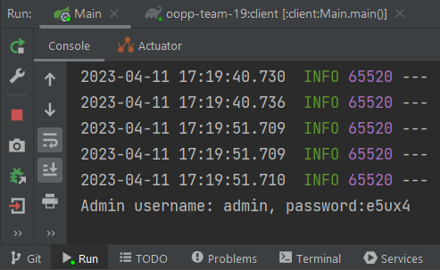

# About the Project
## Description of project
Our project implements the Talio board management application. It contains multi-user functionality, where multiple users can view a board, modify it, and see the changes in real time.

The application allows users to create boards, to which lists can be added. Each list has its own name, which can be modified, and lists can be added and removed.
On each list, cards can be added (and later modified/removed), which contain a name and a description. Cards can  be dragged and dropped within a list (rearranging their implicit priority), and between lists, both rearranging the priority and moving them to a different list.

Multi-board functionality was implemented, where a user can create or join multiple boards, and modify them.

Card customization features are present, which allow the user to create Tasks in a Card (nested task list) - each of which has its own name. Tags can also be added and deleted.

We have added more details about how some of the functionality works, and how to launch the app, in the following subsections.

## Group members

| Profile Picture                                                                                        | Name | Email |
|--------------------------------------------------------------------------------------------------------|---|---|
|      | Matei Grigore | M.Griogre@student.tudelft.nl |
|      | Karol Sperczyński | k.sperczynski@student.tudelft.nl |
|  | Horia Radu | Radu-1@student.tudelft.nl |
|  | María Rosuero | M.RosueroEsparza@student.tudelft.nl 

<!-- Instructions (remove once assignment has been completed -->
<!-- - Add (only!) your own name to the table above (use Markdown formatting) -->
<!-- - Mention your *student* email address -->
<!-- - Preferably add a recognizable photo, otherwise add your GitLab photo -->
<!-- - (please make sure the photos have the same size) --> 

## How to run it

### 1. Version Info

<b>JavaFX download at OpenJFX:</b>
<pre>
Windows	    19.0.2.1	x64	SDK	Download    [SHA256]
</pre>

<b>Java version:</b>

```
$ java --version

java 19.0.2 2023-01-17
Java(TM) SE Runtime Environment (build 19.0.2+7-44)
Java HotSpot(TM) 64-Bit Server VM (build 19.0.2+7-44, mixed mode, sharing)
```

### 2. Download Project

To get the project, you can clone it into your local directory. Then, on Windows, select the folder where the project is contained and select:
```
Open Folder as an IntelliJ IDEA Project
```

You should then see IntelliJ IDEA run, and after the setup is complete, you can start running code.

### 3. Run the server

In order to use the app, a server must be running. The server can be opened by going into the `server` directory and running `Main`.

### 4. Run the client

In order to interact with the GUI, once the server is running, you can launch the Client. You can do so bo going to the `client` directory and running `client.Main`.

### 5. Functionality information

#### Admin login & password

Our application supports restricted admin access. For a user to view the admin view and be able to access
admin functionality, the user must log on using the username and password displayed in the `server console` <u>after a user has joined the server</u>.

It is displayed in the Console view as follows:



#### Deletion of entities

Some entities can only be deleted in the overview if no other entities depend on them. 

<u>Example case:</u>

The app has one `Board 1`, which contains `List 1` and `List 2`, where the first list is empty and the second contains some cards. 

<u>What happens:</u>

In this case, `List 1` can immediately be deleted in the app, but trying to delete `List 2` will not actually delete the list or show any changes.

<u>Explanation:</u>

The first list had no existing entities, so deleting it was immediately reflected on the database. However, to delete `List 2`, <u>the cards on `List 2` must first be deleted</u> in order to be able to delete the list.

Similar behaviour exists for Boards, which need to have all Lists deleted first in order to delete them, and Cards which need to have all tasks deleted in order to delete them.

## How to contribute to it

Contributing to the project can be done by cloning the project from the repository, setting up the required Java versions and configuring IntelliJ IDEA (or any other editor of choice), and configuring your local Git with the correct email (as well as linking the SHH key to GitLab). 

Note that only the developers who were added as Developers on GitLab can contribute.

## Copyright / License (opt.)
